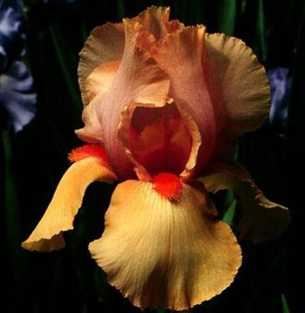
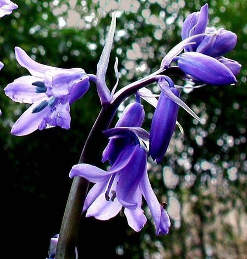
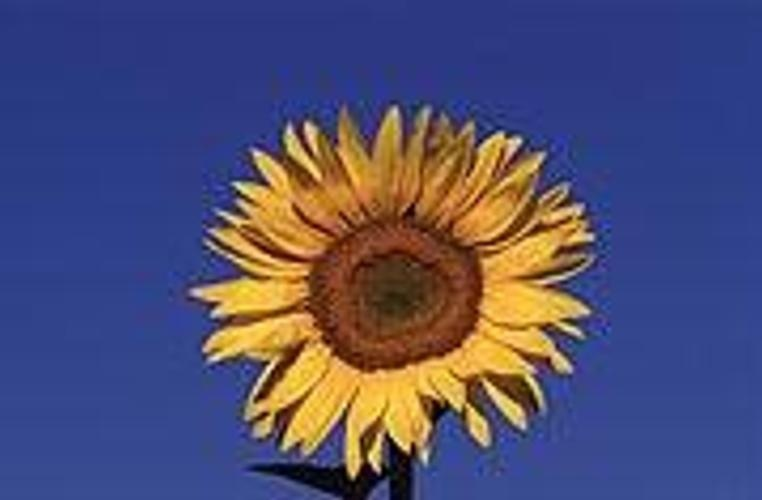
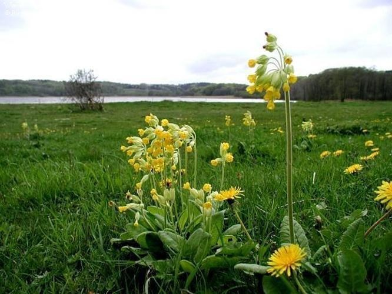
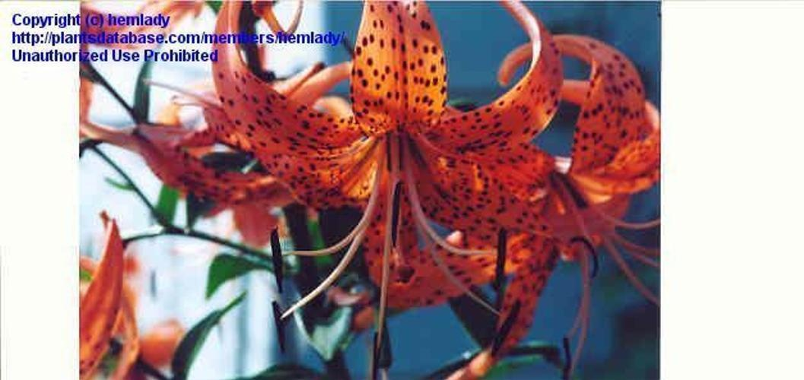

# Simple image search using colour histograms
## Intro
Welcome to this repository for the Image Search Algorithm assignment. Here, you will find my implementation of a simple image search algorithm using OpenCV.
The dataset used in this assignment comprises over 1000 images of flowers, representing 17 different species. These images were sourced from the Visual Geometry Group at the University of Oxford, providing a diverse collection to work with. You can find more information on the dataset [here](https://www.robots.ox.ac.uk/~vgg/data/flowers/17/).

In this project, I developed an image search algorithm based on colour histograms. A colour histogram is a representation of the distribution of colours in an image. It captures the frequencies of different colour values and provides insights into the overall colour composition of an image.
The algorithm finds the 5 most similar images to a target image using the function HISTCMP_CHISQR from OpenCV. The chi-squared distance is a statistical measure that quantifies the difference between two distributions. In the context of image processing and histograms, it helps to assess the similarity or dissimilarity between two colour histograms.


## How to run
To run the code within this repository, you first have to setup a virtual environment containing all the necessary modules. I have provided a script that does this for you, and all you need on your computer beforehand is [pip](https://pypi.org/project/pip/) and [python](https://www.python.org/). The code was developed on ubuntu Debian GNU/Linux 11 (bullseye) with python 3.9.2 and pip 23.1.2. The computer did not have venv although it is a default part of python, so it is installed in setup.sh [line 2](https://github.com/AU-CDS/assignment1-simple-image-search-AddiH/blob/8c44ca9eafe340f3657df0453cc4478bd574ff90/setup.sh#L2) and [line 3](https://github.com/AU-CDS/assignment1-simple-image-search-AddiH/blob/8c44ca9eafe340f3657df0453cc4478bd574ff90/setup.sh#L3). Additionally, pip is upgraded in [line 12](https://github.com/AU-CDS/assignment1-simple-image-search-AddiH/blob/8c44ca9eafe340f3657df0453cc4478bd574ff90/setup.sh#L12). Remember to modify this to suit your needs.


In the terminal, navigate to this repository and run the following:
```
bash setup.sh
```
This installs the necessary modules in a virtual environment. *The code also unzips the data for you, but please ensure the result is a folder called "flowers" with images 0001-1360 and nothing else. If this is not the case, you will have to delete and move excess folders and files.*
Then, to run the analysis and produce the desired outputs, run the following code:
```
bash run.sh
```
## Output
The output is available in the [out](out) folder. Here, you will find a table containing the filename and chi value for each picture. The most similar picture has the lowest chi and is the first file in the table.
|File|Chi|
|---|---|
|image_0245.jpg|10.29|
|image_0097.jpg|11.89|
|image_0791.jpg|11.97|
|image_1099.jpg|12.16|
|image_0519.jpg|12.17|

## Repository structure
```
* ├── data
  │   └── flowers.zip                         <- All flower images compressed into .zip. Remember to check format.
  ├── out
  │   ├── best_mach_to_image_0420             <- Folder with the results of the colour histogram search
  │   │   ├── best_match_to_image_0420.csv    <- .csv file containing the chi value of the most similar images
  │   │   ├── image_0097.jpg                  <- The 5 most similar images
  │   │   ├── image_0245.jpg
  │   │   ├── image_0519.jpg
  │   │   ├── image_0791.jpg
  │   │   ├── image_1099.jpg
  │   │   └── original_image_0420.jpg         <- Original image
  │   └── ..                                  <- If you test other images, results will show up here
  ├── src                      
  │   └── top_chi.py                          <- Script containing code for analysis
  ├── README.md
  ├── requirements.txt                        <- .txt containing needed modules and versions
* ├── run.sh                                  <- Script that runs the analysis within the virtual environment
  ├── setup.sh                                <- Script that sets up the virtual environment
  └── task_description.md                     <- Original readme.md file, courtesy of Ross Deans Kristensen-McLachlan
  
* files/directories that you can change if you wish to customise the code.
```

## Customising
You have a couple of options for customising the code. The stars in the repository structure above denote what files you can modify to fit your needs.
- Data: You have the option of running the analysis on other images. Just add a folder within /data and specify the path in the run.sh file. The run.sh file already has an example of modifying the flag, so look there if you're unsure of how to do it. 
- Specific image: Right now, the analysis is run on image 0420. This is easily changed in the run.sh file. Again, I have provided an example in the file of how to change this. 

## Evaluation
The results are not impressive. As an example, this is the original 0420 picture - I believe it is an Iris.


Below you can see the best matches to this image, along my guess of flower species.


<table>
  <tr>
    <td align="center">
      
      <br>
      <b>Bluebell</b>
    </td><td align="center">
      
      <br>
      <b>Snowdrop</b>
    </td><td align="center">
      
      <br>
      <b>Sunflower</b>
    </td><td align="center">
      
      <br>
      <b>Cowslip</b>
    </td><td align="center">
      
      <br>
      <b>Tiger lily</b>
    </td>
  </tr>
</table>

While the colour histograms of the photos might be similar, this does not translate to finding flowers of the same species. Although the results might make sense mathematically, this method is not great at finding pictures that look similar to humans.

###### This repository is part of a portfolio exam in [Visual Analytics](https://kursuskatalog.au.dk/en/course/115695/Visual-Analytics), which is one of the courses of the supplementary subject [Cultural Data Science at Aarhus University](https://bachelor.au.dk/en/supplementary-subject/culturaldatascience/). You can see an overview of all the projects I have completed for this subject [here](https://github.com/AddiH/Cultural_Data_Science). MIT license applies. 
