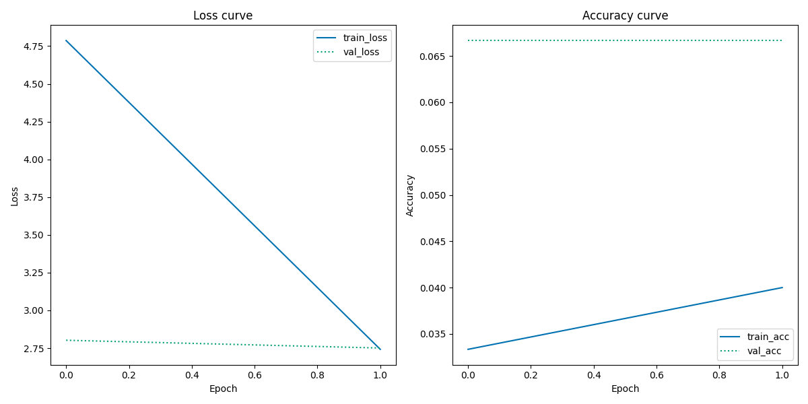

# Transfer learning using pretrained CNNs

## Intro

While the previous repository of this exam equipped feature extraction by simply flattening a grayscale image, this project showcases how a convolutional neural network (CNN) can be used to extract features from an RGB image. The CNN chosen is VGG16, the best model for Visual Recognition in 2014. While newer, larger and more sophisticated CNNs can outperform VGG16, it is still a great model to use for a project like this. 
The data used in this repository is a [kaggle dataset](https://www.kaggle.com/datasets/validmodel/indo-fashion-dataset) consisting of pictures of Indian fashion across 15 categories. VGG16 has not been trained specifically on Indian fashion, but VGG16 can be used to extract features from the images and a fresh neural net can then be trained on the output of VGG16. This process of using pre-trained models is called transfer learning. 
The makers of the indofashion dataset were able to achieve [88.43% classification accuracy](https://arxiv.org/pdf/2104.02830.pdf), by using data argumentation and the CNN [ResNet50](https://se.mathworks.com/help/deeplearning/ref/resnet50.html). This project does not attempt to reach the same level of accuracy, rather it is just meant to showcase how code for a project like this can be structured.

## How to run

To run the code within this repository, you first have to setup a virtual environment containing all the necessary modules. I have provided a script that does this for you, and all you need on your computer beforehand is [pip](https://pypi.org/project/pip/) and [python](https://www.python.org/). The code was developed on ubuntu Debian GNU/Linux 11 (bullseye) with python 3.9.2 and pip 23.1.2. The computer did not have venv although it is a default part of python, so it is installed in setup.sh [line 2]() and [line 3](). Additionally pip is upgraded in [line 12](). Remember to modify this to suit your needs.

### Get kaggle datasets
This code downloads data through the kaggle API. You need to sign up to [kaggle.com](https://www.kaggle.com/) and though your account, download your personal token - a json file. If you are unsure of how to do this, you can read kaggle's description below:

*"From the site header, click on your user profile picture, then on “My Account” from the dropdown menu. This will take you to your account settings at https://www.kaggle.com/account. Scroll down to the section of the page labelled API. To create a new token, click on the “Create New API Token” button. This will download a fresh authentication token onto your machine."*

**Move the token into the data folder** - then you're ready to run the code:

### Execute the code

In the terminal, navigate to this repository and run the following:
```
bash setup.sh
```
This downloads the data and installs the necessary modules in a virtual environment. Then, to train the model and produce the desired outputs, run the following code:
```
bash run.sh
```
Note: As a default the run.sh script uses a tiny version of the dataset, so it is possible to test whether the code works, without waiting for a large dataset to be processed. See how to change this in the "customising" part of this readme.

## Output
Saves your model to results/model, as well as a classification report and history plot to results/.

## Repository structure
```
  ├── data
  │   └── kaggle.sh         <- Bash script downloading the datasets
  ├── results               <- Results from example model
  │   ├── history.png         
  │   └── report.txt
  ├── src
  │   ├── json_to_key.py    <- Takes file paths and labels from json files and saves them in data/key.csv
  │   ├── mini_key.py       <- Takes samples of the data/key.csv to create a subset for testing code
  │   └── train.py          <- Creates and trains the model. Saves model, history plot, and classification report to results/
  ├── utils
  │   ├── file_manage.py    <- Data wrangling functions
  │   ├── plotting.py       <- Functions specifically used for plotting
  │   └── preprocess.py     <- Functions used when preparing the data
  ├── .gitignore
  ├── LICENSE
  ├── README.md
  ├── requirements.txt      <- .txt containing needed modules and versions
* ├── run.sh                <- Script that runs the ML within the virtual environment
  ├── setup.sh              <- Script that sets up the virtual environment and downloads data
  └── task_description.md   <- Assignment prompt by Ross Deans Kristensen-McLachlan
  
* files that you can change if you wish to customise the code.
```

## Customising
If you want to try out different model parameters, you have a couple options. 
- The train.py script has a couple options to change the model and training process. However, this should all be done through [run.sh](https://github.com/AU-CDS/assignment3-pretrained-cnns-AddiH/blob/main/run.sh) with flags, to ensure the code is run in the correct environment. You can can checkout [line 8 of run.sh](https://github.com/AU-CDS/assignment3-pretrained-cnns-AddiH/blob/ad666ac63ca53d02099559fa631eea4a7398e06a/run.sh#L8) for an example of how to use the flags.

Remember: you only need to run setup.sh once, but you can execute run.sh as many times as you wish, customising the code to find the best model. 

## Evaluation
Although the results of the example model run on the tiny subset of data is not ground-breaking *machine learning science*, I'll still provide a brief walkthrough of the outputs of this repository:

The model is saved with the tensorflow command model.save() and will be available in result/model.

The history plot will look like this:

It showcases the loss and accuracy across epochs on the training and validation dataset. Of course the plot of the example model isn't very informative, but after you've run a better model, it will be!

Finally the classification report is available in results/report.txt. The results of the example model are so poor that the function automatically set most of the values to 0:

```
                      precision    recall  f1-score   support

              blouse       0.00      0.00      0.00        10
         dhoti_pants       0.08      0.90      0.15        10
            dupattas       0.00      0.00      0.00        10
               gowns       0.00      0.00      0.00        10
           kurta_men       0.00      0.00      0.00        10
leggings_and_salwars       0.00      0.00      0.00        10
             lehenga       0.00      0.00      0.00        10
         mojaris_men       0.14      0.10      0.12        10
       mojaris_women       0.00      0.00      0.00        10
       nehru_jackets       0.00      0.00      0.00        10
            palazzos       0.00      0.00      0.00        10
          petticoats       0.00      0.00      0.00        10
               saree       0.00      0.00      0.00        10
           sherwanis       0.00      0.00      0.00        10
         women_kurta       0.00      0.00      0.00        10

            accuracy                           0.07       150
           macro avg       0.01      0.07      0.02       150
        weighted avg       0.01      0.07      0.02       150
```

But again, if you wish to utilise your supercomputer to run my code, your results will be much better! You can even try to beat the benchmark of 88% accuracy.

###### This repository is part of a portfolio exam in [Visual Analytics](https://kursuskatalog.au.dk/en/course/115695/Visual-Analytics), which is one of the courses of the supplementary subject [Cultural Data Science at Aarhus University](https://bachelor.au.dk/en/supplementary-subject/culturaldatascience/). You can see an overview of all the projects I have completed for this subject [here](https://github.com/AddiH/Cultural_Data_Science). MIT license applies. 
