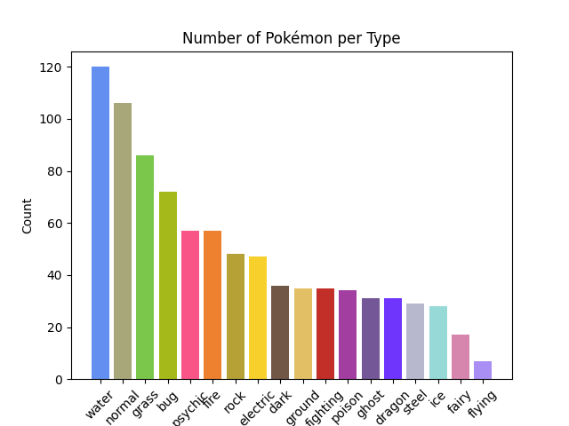

# Pokémon type classification

*Available at: https://github.com/AddiH/Cultural_Data_Science/tree/main/Visual/04_pokemon_classification*

## Intro
Welcome to the GitHub repository for the Pokémon Type Predictor! Have you ever wondered if you could predict the type of a Pokémon just by looking at its picture? Well, this repository houses a neural network that attempts precisely that. While Pokémon enthusiasts might find this task relatively easy the questions is whether a machine can predict the types based on nothing but the looks of the pokemon.

This repository aims to showcase three main aspects of the project:
    
- Script src/prepare.py: This script combines two Kaggle datasets ([here](https://www.kaggle.com/datasets/giovaniandrade/pokemon-images) and [here](https://www.kaggle.com/datasets/hlrhegemony/pokemon-image-dataset)) and performs preprocessing on the images. As part of the data wrangling process, the script merges the datasets and extracts relevant information such as the name, generation, and type of each Pokémon. 

    Additionally, the Pokémon dataset includes multiple images of each Pokémon, each depicting different art styles. This variability in art styles serves as a form of data augmentation, as it helps to diversify the training data. Given the limited number of Pokémon across the 18 types, this approach increases the dataset's richness and allows the neural network to learn from various visual representations of each Pokémon.

    Furthermore, the script processes the PNG images, which initially have transparent backgrounds, and converts them to JPG format with a consistent white background. This preprocessing step ensures that the dataset is standardized and ready for training the neural network.
- Script src/train.py: In this script, a model is trained to predict Pokémon types. VGG16 is chosen to perform feature extraction, it is a convolutional neural network (CNN) known for its effectiveness in image classification tasks. The model parameters build on top of VGG16 are currently set to initial guesses, as the focus of this project is not on finding the absolute best classification model. Instead, the code is designed in a way that makes it easy to customize and experiment with different models. Towards the end of this repository, you will find suggestions on how to improve the model's performance.

- Script src/plotting.py: This script is dedicated to visualizing and analysing the model's training process and its ability to make predictions. It includes various plotting techniques to gain insights into the model's performance. Additionally, a classification report is generated, providing valuable information about the accuracy and precision of the predictions.


## How to run

To run the code within this repository, you first have to setup a virtual environment containing all the necessary modules. I have provided a script that does this for you, and all you need on your computer beforehand is [pip](https://pypi.org/project/pip/) and [python](https://www.python.org/). The code was developed on ubuntu Debian GNU/Linux 11 (bullseye) with python 3.9.2 and pip 23.1.2. The computer did not have venv although it is a default part of python, so it is installed in setup.sh [line 2](https://github.com/AddiH/Cultural_Data_Science/blob/4fb33d2ce2c053b8ffa67bf6ef7a00dbcd89ec4d/Visual/04_pokemon_classification/setup.sh#L2) and [line 3](https://github.com/AddiH/Cultural_Data_Science/blob/4fb33d2ce2c053b8ffa67bf6ef7a00dbcd89ec4d/Visual/04_pokemon_classification/setup.sh#L3). Additionally pip is upgraded in [line 12](https://github.com/AddiH/Cultural_Data_Science/blob/1fe184daecb89d40f033390b6f379b8c1f5ae65a/Visual/04_pokemon_classification/setup.sh#L12). Remember to modify this to suit your needs.

### Get kaggle datasets
This code downloads data through the kaggle API. You need to sign up to [kaggle.com](https://www.kaggle.com/) and though your account, download your personal token - a json file. If you are unsure of how to do this, you can read kaggle's description below:

*"From the site header, click on your user profile picture, then on “My Account” from the dropdown menu. This will take you to your account settings at https://www.kaggle.com/account. Scroll down to the section of the page labelled API. To create a new token, click on the “Create New API Token” button. This will download a fresh authentication token onto your machine."*

**Move the token into the data folder** - then you're ready to run the code:

### Execute the code

In the terminal, navigate to this repository and run the following:
```
bash setup.sh
```
This downloads the data and installs the necessary modules in a virtual environment. Then, to train the model and produce the desired outputs, run the following code:
```
bash run.sh
```
Note: As a default the run.sh script uses a tiny version of the dataset, so it is possible to test whether the code works, without waiting for a large dataset to be processed. See how to change this in the "customising" part of this readme.

## Output

The trained model is located in results/model/. In results/plots/ you will find a graph of the training process, a confusion matrix of actual/predicted labels as well as a bar plot showing the distribution of types (classes) across the images. A classification report is also saved in the results folder.

## Repository structure
```
  ├── data
  │   ├── kaggle.sh                           <- Bash script downloading the datasets
  │   └── rename_key.csv                      <- File containing corrected pokemon names used during pre-processing
  ├── results
  │   ├── archive                             <- Results from example model
  │   │   ├── plots
  │   │   │   ├── confusion_matrix.png   
  │   │   │   ├── history.png 
  │   │   │   └── unique_pokemon_type.png 
  │   │   └── report.txt       
  │   └── plots
  │   │   └── ..
  ├── src
  │   ├── plots.py                            <- Script producing plots and report
* │   ├── prepare.py                          <- Script wrangling data
  │   └── train.py                            <- Script training and saving the model
  ├── utils
  │   ├── homemade_functions.py               <- Various functions utilised in scripts
  │   └── plotting.py                         <- Functions specifically used for plotting
  ├── .gitignore
  ├── LICENSE
  ├── README.md
  ├── requirements.txt                        <- .txt containing needed modules and versions
* ├── run.sh                                  <- Script that runs the ML within the virtual environment
  └── setup.sh                                <- Script that sets up the virtual environment and downloads data
  
* files that you can change if you wish to customise the code.
```

# Customising
If you want to try out different model parameters, you have a couple options. 
- The test data is the newest generation of pokemon (8), but you can choose a different train/val split In [setup.sh](https://github.com/AddiH/Cultural_Data_Science/blob/4fb33d2ce2c053b8ffa67bf6ef7a00dbcd89ec4d/Visual/04_pokemon_classification/setup.sh#L19). I have chosen 70/30 as the dataset is quite small, and with a too small validation set overfitting can easily occur.
- The train.py script has a couple options to change the model and training process. However, this should all be done through [run.sh](https://github.com/AddiH/Cultural_Data_Science/blob/main/Visual/04_pokemon_classification/run.sh) with flags, to ensure the code is run in the correct environment. You can run [line 18](https://github.com/AddiH/Cultural_Data_Science/blob/4fb33d2ce2c053b8ffa67bf6ef7a00dbcd89ec4d/Visual/04_pokemon_classification/run.sh#L18) of run.sh to get information on what each argument changes. 
Remember: you only need to run setup.sh once, but you can execute run.sh as many times as you wish, customising the code to find the best model. Also note that the flags for plot.py should be identical to those for train.py - but this should be clear when looking though the code.

## Evaluation
Below, you can see a plot of the training of the model:


Here, it is clear to see that the model needs a lot of adjustments before it is useful. Ideally the curves should closely follow each other. While a big issue is the lack of finetuning of the model parameters, a couple of other things could also be causing this:

- The dataset could be too small:
  If we take a look at distribution of unique pokemon (without the "data argumentation" step of adding different art styles) the distribution looks like this:  
  
  
  While the dataset complete with data argumentation from the combined datasets consists of 3272 unique images, there are only a total of   876 unique pokemon, and 85 of these are from generation 8 and thus removed for the testing dataset. Since the split is 70/30 that leaves only 553 unique pokemons for the training dataset. While this model can clearly be optimised, it is possible that the data is simply not rich enough to train a model to perform classification well. While the actual total number of pokemon is 1015 including a brand new generation 9, I do not believe that adding the last 139 unique pokemon would be enough to solve this problem.

- The appearance of a Pokémon doesn't necessarily reveal much about its type, contrary to what I expected. To explore this further, I conducted an experiment where I tested how well real people could predict the types of Pokémon from the eighth generation. I chose the latest generation because most of the participants were only familiar with the first few generations of Pokémon. You could say that these humans were "trained" on the older Pokémon when they were kids, but they weren't familiar with the new ones, just like how machines are trained. The participants' accuracy scores ranged from 50% to 57%. While these results are way better than the model presented here, the results could suggest that the type of a pokemon just isn't that obvious from its appearance.
  
Lets have a look at the classification report:
```
                precision    recall  f1-score   support
  
           bug       0.21      0.43      0.29         7
          dark       0.27      0.18      0.21        17
        dragon       0.27      0.38      0.32         8
      electric       0.00      0.00      0.00        15
         fairy       0.00      0.00      0.00         6
      fighting       0.33      0.12      0.18        16
          fire       0.18      0.29      0.22        14
        flying       0.00      0.00      0.00        10
         ghost       0.00      0.00      0.00         8
         grass       0.62      0.62      0.62        21
        ground       0.00      0.00      0.00         7
           ice       0.12      0.09      0.11        11
        normal       0.12      0.33      0.17         9
        poison       0.00      0.00      0.00         3
       psychic       0.18      0.14      0.16        14
          rock       0.29      0.40      0.33        10
         steel       0.00      0.00      0.00        10
         water       0.23      0.32      0.27        22
  
      accuracy                           0.22       208
     macro avg       0.16      0.18      0.16       208
  weighted avg       0.20      0.22      0.20       208
```
The accuracy of 0.22 is well below the humans' results. We can also visualise the results in a confusion matrix:


As expected from the classification report, the confusion matrix is not lighting up with a perfect diagonal line, as I could have hoped. Curiously it would seem that the model is miles better at predicting grass pokemon than the other types. If you refer to the bar plot, you will see that the grass class contains a lot of pokemon, which could help the model in training. Grass pokemons are often green, and this consistent style choice by the designers could also be a factor in the decent prediction results for this class.

While this dataset is mostly just fun to work with, and the model is quite rubbish, this repository showcases how you can customise datasets to work for you, and how a model can be trained using tensorflow. With more time and resources, I'm certain that it is possible to develop a model with another architecture that can predict the types of pokemon with a higher level of accuracy.

###### This repository is part of a portfolio exam in [Visual Analytics](https://kursuskatalog.au.dk/en/course/115695/Visual-Analytics), which is one of the courses of the supplementary subject [Cultural Data Science at Aarhus University](https://bachelor.au.dk/en/supplementary-subject/culturaldatascience/). You can see an overview of all the projects I have completed for this subject [here](https://github.com/AddiH/Cultural_Data_Science). MIT license applies. 
